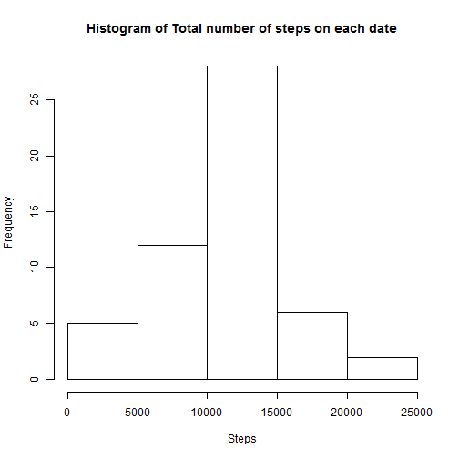
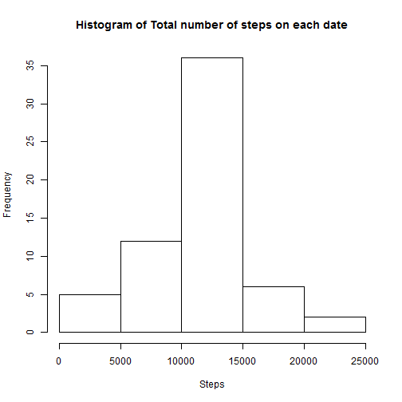
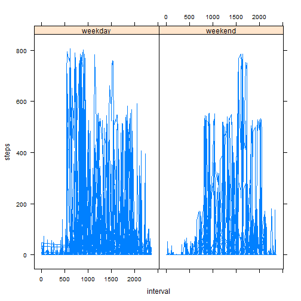

## Introduction  

It is now possible to collect a large amount of data about personal movement using activity monitoring devices such as a Fitbit, Nike Fuelband, or Jawbone Up. These type of devices are part of the " quantified self " movement - a group of enthusiasts who take measurements about themselves regularly to improve their health, to find patterns in their behavior, or because they are tech geeks. But these data remain under-utilized both because the raw data are hard to obtain and there is a lack of statistical methods and software for processing and interpreting the data.

This assignment makes use of data from a personal activity monitoring device. This device collects data at 5 minute intervals through out the day. The data consists of two months of data from an anonymous individual collected during the months of October and November, 2012 and include the number of steps taken in 5 minute intervals each day.  

## Data  

The data for this assignment can be downloaded from [here](https://d396qusza40orc.cloudfront.net/repdata%2Fdata%2Factivity.zip).  

The variables included in this dataset are:  
- steps: Number of steps taking in a 5-minute interval (missing values are coded as NA).  
- date: The date on which the measurement was taken in YYYY-MM-DD format.  
- interval: Identifier for the 5-minute interval in which measurement was taken.  

The dataset is stored in a comma-separated-value (CSV) file and there are a total of 17,568 observations in this dataset.  

***  

## Assignment  


```r
activity_data <- read.csv("activity.csv")
head(activity_data)
```

```
##   steps       date interval
## 1    NA 2012-10-01        0
## 2    NA 2012-10-01        5
## 3    NA 2012-10-01       10
## 4    NA 2012-10-01       15
## 5    NA 2012-10-01       20
## 6    NA 2012-10-01       25
```

There are a lot of missing values in the dataset, so I will consider only complete cases to do the analysis.


```r
complete_cases <- complete.cases(activity_data)
activity <- activity_data[complete_cases, ]
head(activity_data)
```

```
##   steps       date interval
## 1    NA 2012-10-01        0
## 2    NA 2012-10-01        5
## 3    NA 2012-10-01       10
## 4    NA 2012-10-01       15
## 5    NA 2012-10-01       20
## 6    NA 2012-10-01       25
```

### What is mean total number of steps taken per day? 

1. Calculate the total number of steps taken per day.  


```r
date_wise_step_tot <- tapply(activity$steps, activity$date, sum)
date_wise_step_tot <- date_wise_step_tot[complete.cases(date_wise_step_tot)]
head(date_wise_step_tot)
```

```
## 2012-10-02 2012-10-03 2012-10-04 2012-10-05 2012-10-06 2012-10-07 
##        126      11352      12116      13294      15420      11015
```

2. Make a histogram of the total number of steps taken each day.  


```r
hist(date_wise_step_tot, xlab = "Steps", main = "Histogram of Total number of steps on each date")
```

 

3. Calculate and report the mean and median of the total number of steps taken per day.  

for mean


```r
mean(date_wise_step_tot)
```

```
## [1] 10766.19
```

for median  

```r
median(date_wise_step_tot)  
```

```
## [1] 10765
```
### What is the average daily activity pattern?  

1. Make a time series plot (i.e. type = "l") of the 5-minute interval (x-axis) and the average number of steps taken, averaged across all days (y-axis)  


```r
stepXinterval <- aggregate(steps ~ interval, data = activity, FUN = mean)
plot(stepXinterval, type = "l")
```

 

2. Which 5-minute interval, on average across all the days in the dataset, contains the maximum number of steps?  


```r
stepXinterval$interval[ which.max(stepXinterval$steps)]
```

```
## [1] 835
```


###  Imputing missing values  

1. Calculate and report the total number of missing values in the dataset (i.e. the total number of rows with NAs)  


```r
sum(!complete_cases)
```

```
## [1] 2304
```

2. Devise a strategy for filling in all of the missing values in the dataset. The strategy does not need to be sophisticated. For example, you could use the mean/median for that day, or the mean for that 5-minute interval, etc.  


```r
for (i in 1:dim(activity_data)[1])
{
        if(is.na(activity_data$steps[i]))
        {
                interval = activity_data$interval[i]
                activity_data$steps[i] <- stepXinterval$steps[ match(interval, stepXinterval$interval) ]
        }
}
```
3. Create a new dataset that is equal to the original dataset but with the missing data filled in.  

```r
activity_new <- activity_data
head(activity_new)
```

```
##       steps       date interval
## 1 1.7169811 2012-10-01        0
## 2 0.3396226 2012-10-01        5
## 3 0.1320755 2012-10-01       10
## 4 0.1509434 2012-10-01       15
## 5 0.0754717 2012-10-01       20
## 6 2.0943396 2012-10-01       25
```
4. Make a histogram of the total number of steps taken each day and Calculate and report the mean and median total number of steps taken per day. Do these values differ from the estimates from the first part of the assignment? What is the impact of imputing missing data on the estimates of the total daily number of steps?  


```r
date_step <- tapply(activity_new$steps, activity_new$date, sum)
hist(date_step, xlab = "Steps", main = "Histogram of Total number of steps on each date")
```

 
  
#### Mean is  

```r
mean(date_step)
```

```
## [1] 10766.19
```

#### Median is  

```r
median(date_step)
```

```
## [1] 10766.19
```
  
### Are there differences in activity patterns between weekdays and weekends?  
1. Create a new factor variable in the dataset with two levels ??? ???weekday??? and ???weekend??? indicating whether a given date is a weekday or weekend day.   

```r
weekday <- weekdays(as.Date(activity_new$date))
print(typeof(weekday))
```

```
## [1] "character"
```

```r
for(i in 1:length(weekday))
{
        if (weekday[i] == "Sunday" || weekday[i] == "Saturday")
        {
                weekday[i] = "weekend"
        }
        
        else
        {
                weekday[i] = "weekday"
        }
}

weekday <- factor(weekday)
print(levels(weekday))
```

```
## [1] "weekday" "weekend"
```

```r
activity_new <- cbind(activity_new, weekday)
head(activity_new)
```

```
##       steps       date interval weekday
## 1 1.7169811 2012-10-01        0 weekday
## 2 0.3396226 2012-10-01        5 weekday
## 3 0.1320755 2012-10-01       10 weekday
## 4 0.1509434 2012-10-01       15 weekday
## 5 0.0754717 2012-10-01       20 weekday
## 6 2.0943396 2012-10-01       25 weekday
```
2. Make a panel plot containing a time series plot (i.e. type = "l") of the 5-minute interval (x-axis) and the average number of steps taken, averaged across all weekday days or weekend days (y-axis).


```r
library(latticeExtra)
interval <- activity_new$interval
steps <- activity_new$steps
fac <- activity_new$weekday
xyplot(steps ~ interval |fac, type = "l")
```

 
